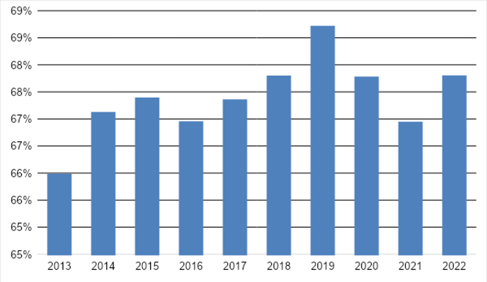

```{r setup, include=FALSE}
options(htmltools.dir.version = FALSE)
knitr::opts_chunk$set(
  cache = FALSE,
  echo = TRUE,
  message = FALSE, 
  warning = FALSE,
  hiline = TRUE
)
```

```{r xaringan-themer, include=FALSE, warning=FALSE}
library(xaringanthemer)
style_duo_accent(
  primary_color = "#1381B0",
  secondary_color = "#FF961C",
  inverse_header_color = "#FFFFFF"
)
```

<div class="footer"></div>
<div class="header"></div>

<br> <br> <br> <br> 

<p style='text-align:center;'> .h1_title[Consumo e endividamento das famílias brasileiras:] </p>

<p style='text-align:center;'> .h2_title[uma análise para o período entre 2013 e 2022] </p>

<br>
<p style='text-align:center;'> .long_title[Luísa Gisele Böck<sup>1</sup>, Ednalva Felix das Neves<sup>2</sup>, Sibele Vasconcelos de Oliveira<sup>3</sup>, Rita Inês Paetzhold Pauli<sup>4</sup>] </p>


<p text align="right">.authors[<sup>1</sup> Graduada em Ciências Econômicas pela Universidade Federal de Santa Maria (UFSM). E-mail: <a href='mailto:luisa.bock@acad.ufsm.br'> luisa.bock@acad.ufsm.br </a> <br> <sup>2</sup> Professora do Departamento de Economia e Relações Internacionais e do Programa de Pós-Graduação em Economia <br> e Desenvolvimento da Universidade Federal de Santa Maria. E-mail: <a href='mailto:ednalva.felix@ufsm.br'> ednalva.felix@ufsm.br </a> <br> <sup>3</sup> Professora do Departamento de Economia e Relações Internacionais e do Programa de Pós-Graduação em Economia <br> e Desenvolvimento da Universidade Federal de Santa Maria. E-mail: <a href='mailto:sibele.oliveira@ufsm.br'> sibele.oliveira@ufsm.br </a> <br> <sup>4</sup> Professora do Departamento de Economia e Relações Internacionais e do Programa de Pós-Graduação em Economia <br> e Desenvolvimento da Universidade Federal de Santa Maria. E-mail: <a href='mailto:rita.pauli@gmail.com'> rita.pauli@gmail.com </a>]</p>

---

<div class="footer"></div>
<div class="header"></div>

<br> <br> <br> <br> <br>

<p style='text-align:center;'> .h3_title[1 INTRODUÇÃO] </p>

.left-column[
<br>
<br>
<br>
<font size='7'><strong><font color='#000000'>CONSUMO</font></strong></font>
]

.right-column[
- uma das variáveis mais importantes do Sistema de Contas Nacional
<br>
<br>
- permite compreender a acessibilidade das famílias aos bens e serviços ofertados
<br>
<br>
- é um dos principais componentes do Produto Interno Bruto (PIB), tendo representado cerca de 60% deste nos últimos anos <a href='#referencias-slide'>(Carvalho <i>et al.</i>, 2016)</a>.
<br>
<br>
- depende:
  - renda presente auferida pelas famílias;
  - rendas passadas; 
  - expectativa de rendas futuras (endividamento) <a href='#referencias-slide'>(Passos e Nogami, 1998; Rossetti, 2003)</a>.
]

---

<div class="footer"></div>
<div class="header"></div>

<br> <br> <br> <br> <br> <br>

.metade-esquerda-maior[
<br>
<font size='7'><strong><font color='#000000'>ENDIVIDAMENTO</font></strong></font>
<br>
<br>
<br>
<br>
<br>
<br>
<font size='7'><strong><font color='#000000'>INADIMPLÊNCIA</font></strong></font>
]

.metade-direita-menor[
- existênca de uma obrigação que será saldada após o pagamento <a href='#referencias-slide'>(Carvalho, Sousa e Fuentes, 2017)</a> 
<br>
<br>
- resultado do acúmulo de dívidas, resultado da ação de não pagar o que foi usufruído <a href='#referencias-slide'>(Camargos, 2022)</a>.
<br>
<br>
<br>
<br>
<br>
- não cumprimento com a obrigação de pagar pelo uso de um bem ou serviço no passado, com previsão de pagamento futuro.
]

---

<div class="footer"></div>
<div class="header"></div>

<br> <br> <br> <br> <br>

<p style='text-align:center;'> .h3_title[2 ASCENSÃO E RUPTURA DO PADRÃO DE DESENVOLVIMENTO BRASILEIRO] </p>

.left-column[
  
]

.right-column[
- Mantem o *tripé macroeconômico* introduzido por seu antecessor Fernando Henrique Cardoso, que incluía metas de inflação, câmbio flutuante e superávit primário [(Bresser Pereira, 2012)](#referencias-slide)
<br>
<br>
- Mesmo com fraco desempenho do investimento e do crescimento do produto, a expansão do consumo familiar ocorreu em virtude de: 
  - expansão das transferências de renda;
  - programas assistenciais;
  - melhorias no mercado de trabalho (aumento do emprego e valorização do salário mínimo);
  - expansão do crédito (pessoas de menor renda). [(Gremaud *et al.*, 2017)](#referencias-slide)
]

---

<div class="footer"></div>
<div class="header"></div>

<br> <br> <br> <br>

.coluna-esquerda[
- Expansão dos investimentos e do consumo com relativa estabilidade econômica
<br>
<br>
- Retomada do crescimento;
  - Melhora das condições de emprego (redução da taxa de desemprego e aumento da formalização);
  - Aumento da renda dos indivíduos;
  - Incorporação de novos agentes aos mercados de bens e serviços, além do mercado de crédito. [(Gremaud *et al.*, 2017)](#referencias-slide)


<strong><font color="#000000">CRISE ECONÔMICA MUNDIAL (2008)</font></strong>

- Políticas anticíclicas de estímulo fiscal:
  - redução de impostos (IPI automóveis, eletrodomésticos, materiais de construção, entre outros);
  - expansão do crédito pelos bancos públicos.
]

.coluna-direita[
<br>
  
]

---

<div class="footer"></div>
<div class="header"></div>

<br> <br> <br>

.left-column[
<br> <br>
  
]

.right-column[
- Assume a presidência em 2011, herdando o *Modelo de Consumo de Massa*:
  - expansão do consumo das famílias (melhor distribuição e transferência de renda, expansão do crédito ao consumidor e fortalecimento do mercado de trabalho - valorização do salário mínimo) [(Cardoso e Reis, 2022)](#referencias-slide);
  - arrefecimento (baixas taxas de poupança e investimento, com perda dos ganhos de produtividade), resultando em limitação da capacidade produtiva e em significativas pressões inflacionárias [(Gremaud *et al.*, 2017; Bastos, 2017)](#referencias-slide)
<br>
<br>  
- Crescimento econômico baseado na criação de emprego, redução das taxas de desemprego e da ocupação da capacidade ociosa em resposta à ampliação da demanda já não se verificava mais
<br>
<br>
- Piora de diversos indicadores econômicos: a queda do produto, o aumento das taxas de inflação e de juros, déficits primário e nominal e a elevação da dívida pública em proporção ao PIB [(Gremaud *et al.*, 2017; Cardoso e Reis, 2022)](#referencias-slide).
]

---

<div class="footer"></div>
<div class="header"></div>

<br> <br> <br> <br>

.coluna-esquerda[
<br>
- Diagnóstico e propostas de atuação ortodoxas da gestão econômica
<br>
<br>
- Interpretou a crise econômica como sendo oriunda da má gestão da política econômica, em especial, da política fiscal;

<strong><a href='https://static.poder360.com.br/2017/07/ponteparaofuturo.pdf'><font color="#000000">Uma ponte para o futuro</font></a></strong>: texto publicado pelo [PMDB](#referencias-slide), partido de Temer, que evidencia uma clara guinada às práticas ortodoxas, especialmente na política monetária e cambial.

- Regra do teto dos gastos (2016)

- Reforma trabalhista (2017)
]

.coluna-direita[
  
]

---

<div class="footer"></div>
<div class="header"></div>

<br> <br> <br> <br> 

.left-column[
<br> <br>
  
]

.right-column[
- Promessa de continuar o programa liberal econômico iniciado por Temer: 
  - austeridade fiscal; e 
  - aprofundamento das reformas econômicas;
<br>
<br>
- Reforma da Previdência (2019)

- Autonomia do Banco Central (2021)
<br>
<br>
- Estas reformas fragilizaram a recuperação da economia brasileira no pós crise do governo Dilma [(Cardoso e Reis, 2022; Carneiro, 2019)](#referencias-slide) e criaram um "pano de fundo" para o enfrentamento à crise econômica causada pela pandemia de Covid-19.
]

---

<div class="footer"></div>
<div class="header"></div>

<br> <br> <br> <br> <br>

<p style='text-align:center;'> .h3_title[3 A PANDEMIA DE COVID-19 E O IMPACTO NO PIB E NO CONSUMO BRASILEIRO] </p>

- No momento em que o Brasil vivenciava uma crise econômica, foi assolado pela pandemia de Covid-19
<br>
<br>
- A crise sanitária teve duro efeito na economia brasileira:
<br>

<center><font size="4"><strong><font color="#000000">Quadro 1 - Variação do PIB e componentes do PIB entre 2019 e 2020</font></strong></font></center>

| <strong><font color="#000000">PIB</font></strong> | <strong><font color="#000000">Consumo das Famílias</font></strong> | <strong><font color="#000000">Consumo do Governo</font></strong> | <strong><font color="#000000">Formação Bruta do Capital Fixo</font></strong> | <strong><font color="#000000">Exportação</font></strong> | <strong><font color="#000000">Importação</font></strong> |
|:-------:|:------------------------:|:----------------------:|:----------------------------------:|:--------------:|:--------------:|
|  -3,57% |          -4,88%          |         -3,68%         |               -1,73%               |     -2,72%     |     -9,81%     |

<center><font size="4">Fonte: <a href='#referencias-slide'><font color="#000000">SCNT/IBGE (2023)</font></a>.</font></center>

- A adoção de medidas emergenciais (auxílio emergencial) foi fator importante para assegurar que o consumo sofresse retração ainda maior;

---

<div class="footer"></div>
<div class="header"></div>

<br> <br> <br> <br> <br>

<p style='text-align:center;'> .h3_title[4 METODOLOGIA] </p>

<strong><font color="#000000">OBJETIVO:</font></strong> Analisar os aspectos do consumo e do endividamento da famílias brasileiras entre o período de 2013 a 2022.

- Pesquisa bibliográfica (contextualização dos temas abordados e do período histórico abordado);
- Pesquisa documental e análise de dados secundários:
  - sites oficiais do governo (IBGE, IPEA, BACEN, etc);
  - órgão particulares que representam sindicatos e empresas do setor terciário brasileiro (DIEESE, CNC, etc).

- As informações quantitativas consideradas centram-se nas variáveis de Consumo das Famílias e no Produto Interno Bruto (PIB) brasileiros do Sistema de Contas Nacionais Trimestrais (SCNT);
- Foram considerados dados deflacionados com base nos preços de 1995.

---

<div class="footer"></div>
<div class="header"></div>

<br> <br> <br> <br>

<p style='text-align:center;'> .h3_title[5 RESULTADOS E DISCUSSÃO] </p>

.graficos[
<center><font size="4"><strong><font color="#000000">Figura 1 - Consumo das Famílias Brasileiras - em milhões de R$ - 2013/2022</font></strong></font></center>

<center></center>

<center><font size="3">Fonte: <a href='#referencias-slide'><font color="#000000">SCNT/IBGE (2023)</font></a>.</font></center>
]

.analises[
- <font size='4'>Queda do consumo entre os anos de 2015 e 2016, com posterior recuperação</font>
<br>
<br>
- <font size='4'>Com a pandemia, em 2020, o consumo voltou a cair</font>
<br>
<br>
- <font size='4'>Com a as medidas econômicas aprovadas e a retomada do comércio e do setor de serviços, o consumo voltou a crescer.</font>
]

---

<div class="footer"></div>
<div class="header"></div>

<br> <br> <br> <br>

.graficos[
<center><font size="4"><strong><font color="#000000">Figura 2 - Taxa de variação (%) do consumo das famílias e do PIB no Brasil - 2013/2022</font></strong></font></center>

<center></center>

<center><font size="3">Fonte: <a href='#referencias-slide'><font color="#000000">SCNT/IBGE (2023)</font></a>.</font></center>
]

.analises[
<br>
<br>
- <font size='4'>Com exceção da crise econômica (2015) e da crise causada pela pandemia (2020), o consumo varia mais do que o PIB</font>
<br>
<br>
- <font size='4'>Nos momentos de crises econômicas, o consumo se retrai em maior proporção em relação a queda do PIB.</font>
]

---

<div class="footer"></div>
<div class="header"></div>

<br> <br> <br> <br>

.graficos[
<center><font size="4"><strong><font color="#000000">Figura 3 - Taxa de variação acumulada em 12 meses do consumo <i>per capita</i> das famílias - 2019/2022</font></strong></font></center>

<center></center>

<center><font size="3">Fonte: <a href='#referencias-slide'><font color="#000000">Dados do IBGE, (Ipeadata, 2022)</font></a>.</font></center>
]

.analises[
<br>
<br>
- <font size='4'>Queda significativo no 1º semestre de 2020</font>
<br>
<br>
- <font size='4'>Com as medidas econômicas aprovadas e a vacinação da população, o consumo <i>per capita</i> das famílias apresentou recuperação.</font>
]

---

<div class="footer"></div>
<div class="header"></div>

<br> <br> <br> <br>

.graficos[
<center><font size="4"><strong><font color="#000000">Figura 4 - Percentual do consumo das famílias sobre o PIB brasileiro - 2013/2022</font></strong></font></center>

<center></center>

<center><font size="3">Fonte: <a href='#referencias-slide'><font color="#000000">SCNT/IBGE (2023)</font></a>.</font></center>
]

.analises[
<br>
<br>
- <font size='4'>O consumo representa mais de 60% do PIB</font>
<br>
<br>
- <font size='4'>O peso do consumo no PIB foi negativamente impactado pelas crises (2015 e 2020), marcando a reversão da tendência de crescimento.</font>
]

---

<div class="footer"></div>
<div class="header"></div>

<br> <br> <br> <br>

.graficos[
<center><font size="4"><strong><font color="#000000">Figura 5 - Variação acumulada durante o ano do IPCA no Brasil - 2012/2022</font></strong></font></center>

<center></center>

<center><font size="3">Fonte: <a href='#referencias-slide'><font color="#000000">IBGE (2022a)</font></a>.</font></center>
]

.analises[
<br>
<br>
- <font size='4'>O IPCA registra dois picos:</font>
  <br>
  <br>
  <font size='4'> * em 2015, com a crise de 2015 decorrente da reação do mercado aos gastos governamentais;</font>
  <br>
  <br>
  <font size='4'> * em 2021, com a redução da oferta agregada em razão da pandemia.</font>
]

---

<div class="footer"></div>
<div class="header"></div>

<br> <br> <br> <br> <br>

.graficos[
<center><font size="4"><strong><font color="#000000">Figura 6 - Endividamento das famílias em SP - % do total de famílias - 2013/2022</font></strong></font></center>

<center></center>

<center><font size="3">Fonte: <a href='#referencias-slide'><font color="#000000">CNC-PEIC (2022a)</font></a>.</font></center>
]

.analises[
<br>
- <font size='4'>Tanto o endividamento quanto a inadimplência começaram a aumentar em 2014, seguindo a tendência de crescimento</font>
<br>
<br>
- <font size='4'>Aumento substancial do endividamento (em 2020), refletindo os efeitos da pandemia sobre a renda dos brasileiros</font>
]

---

<div class="footer"></div>
<div class="header"></div>

<br> <br> <br> <br>

.graficos[
<center><font size="4"><strong><font color="#000000">Figura 7 - Intenção de consumo familiar - pontos - 2013/2022</font></strong></font></center>

<center></center>

<center><font size="3">Fonte: <a href='#referencias-slide'><font color="#000000">CNC-ICF (2022b)</font></a>.</font></center>
]

.analises[
<br>
<br>
<br>
- <font size='4'>A intenção de consumo das famílias parece indicar uma recuperação do consumo</font>
]

---

<div class="footer"></div>
<div class="header"></div>

<br> <br> <br> <br> <br>

<p style='text-align:center;'> .h3_title[6 CONCLUSÃO] </p>

<br>
- <p text align="justify">O cenário brasileiro entre os anos de 2013 e 2022 foi afetado por duas crises: a crise econômica de 2015 e a crise econômica e sanitária causada pela pandemia de Covid-19. Ambas foram danosas para o crescimento econômico e para o consumo das famílias.</p>

- <p text align="justify">As principais consequências dizem respeito à elevação dos índices de inflação e redução dos níveis de consumo, com recrudescimento do endividamento familiar.</p>

- <p text align="justify">Com relação ao comportamento do cenário futuro, a <a href='referencias-slide'>OCDE (2022)</a> assinala que o consumo das famílias, juntamente com o investimento privado e as exportações serão os principais motores de crescimento do Brasil.</p>

---
name: referencias-slide

<div class="footer"></div>
<div class="header"></div>

<br> <br> <br> <br> <br>

<p style='text-align:center;'> .h3_title[REFERÊNCIAS] </p>

BASTOS, Pedro Paulo Zahluth. Ascensão e crise do governo Dilma Rousseff e o golpe de 2016: poder estrutural, contradição e ideologia. <strong><font color="#000000">Revista de Economia Contemporânea.</font></strong> Rio de Janeiro, v. 21, p. 1- 63, 2017.

BRESSER-PEREIRA, Luiz Carlos. O governo Dilma frente ao "tripé macroeconômico" e à direita liberal e dependente. <strong><font color="#000000">Novos estudos CEBRAP</font></strong>, p. 5-15, 2013.

CAMARGOS, Matheus Augusto Reis. Análise do comportamento do nível de endividamento dos brasileiros. 2022. 19 f. Trabalho de Conclusão de Curso (Graduação em Ciências Contábeis) – Universidade Federal de Uberlândia, Uberlândia, 2022. Disponível em: https://repositorio.ufu.br/handle/123456789/35495. Acesso em: 24 ago. 2023.

CARDOSO, Fernanda Graziella; REIS, Cristina Fróes de Borja (Orgs.). <strong><font color="#000000">Desafios do Desenvolvimento Brasileiro pós-Covid-19.</font></strong> São Carlos: Pedro & João Editores, 2022. Disponível em: https://www.saopaulo.sp.leg.br/escoladoparlamento/wp-content/uploads/sites/5/2022/08/EBOOK_Desafios-do-desenvolvimento-brasileiro-po%CC%81s-Covid-19.pdf. Acesso em: 15 set. 2023.

---

<div class="footer"></div>
<div class="header"></div>

<br> <br> <br> <br> <br> 

CARNEIRO, Ricardo. A agenda econômica anacrônica do Governo Bolsonaro. <strong><font color="#000000">Brazilian Keynesian Review</font></strong>, v. 5, n. 1, p. 154-173, 2019. Disponível em: https://www.braziliankeynesianreview.org/BKR/article/view/200. Acesso em: 15 set. 2023.

CARVALHO, Helder Araujo de; SOUSA, Felipe Gerhard Paula; FUENTES, Verónica Ligia Peñaloza. Representação social do endividamento individual. <strong><font color="#000000">Revista Pensamento Contemporâneo em Administração</font></strong>, v. 11, n. 1, p. 100-115, 2017.

CARVALHO, Sandro Sacchet de et al. O consumo das famílias no Brasil entre 2000 e 2013: uma análise estrutural a partir de dados do Sistema de Contas Nacionais e da Pesquisa de Orçamentos Familiares. <strong><font color="#000000">Instituto de Pesquisa Econômica Aplicada (IPEA)</font></strong>, 2016. Disponível em: https://www.ipea.gov.br/portal/images/stories/PDFs/TDs/td_2209.pdf. Acesso em: 26 ago. 2023.

CNC. Pesquisa de Endividamento e Inadimplência do Consumidor (PEIC). <strong><font color="#000000">Confederação Nacional do Comércio de Bens, Serviços e Turismo (CNC)</font></strong>, Brasília, 2022a. Disponível em: https://www.portaldocomercio.org.br/publicacoes/. Acesso em: 25 ago. 2023.

---

<div class="footer"></div>
<div class="header"></div>

<br> <br> <br> <br> <br> 

CNC. Pesquisa de Intenção de Consumo das Famílias (ICF). <strong><font color="#000000">Confederação Nacional do Comércio de Bens, Serviços e Turismo (CNC)</font></strong>, Brasília, 2022b. Disponível em: https://www.portaldocomercio.org.br/publicacoes/. Acesso em: 25 ago. 2023.

CORACCINI, Raphael. IGP-M: Entenda como funciona o “índice de inflação do aluguel”. <strong><font color="#000000">CNN Brasil</font></strong>, São Paulo, 30 ago. 2021. Disponível em: https://www.cnnbrasil.com.br/business/igp-m-entenda- como-funciona-o-indice-de-inflacao-do-aluguel/. Acesso em: 15 ago. 2023.

GREMAUD, Amaury Patrick; VASCONCELOS, Marco Antonio Sandoval de; TONETO JR. Rudinei. <strong><font color="#000000">Economia Brasileira Contemporânea.</font></strong> 8a. ed. São Paulo: Atlas, 2017.

IBGE. Índice Nacional de Preços ao Consumidor Amplo (IPCA). <strong><font color="#000000">Instituto Brasileiro de Geografia e Estatística (IBGE)</font></strong>, Rio de Janeiro: IBGE, 2022a. Disponível em: https://www.ibge.gov.br/estatisticas/economicas/precos-e-custos/9256-indice-nacional-de-precos-ao-consumidor-amplo.html?t=series-historicas&utm_source=landing&utm_medium=explica&utm_campaign=inflacao#plano-real-mes. Acesso em: 25 ago. 2023.

---

<div class="footer"></div>
<div class="header"></div>

<br> <br> <br> <br> <br> <br>

IBGE. Inflação. <strong><font color="#000000">Instituto Brasileiro de Geografia e Estatística (IBGE)</font></strong>, Rio de Janeiro: IBGE, 2022b. Disponível em: https://www.ibge.gov.br/explica/inflacao.php. Acesso em: 13 dez. 2022.

IBGE. Sistema de Contas Nacionais Trimestrais (SCNT). <strong><font color="#000000">Instituto Brasileiro de Geografia e Estatística (IBGE)</font></strong>, Rio de Janeiro: IBGE, 2023. Disponível em: https://www.ibge.gov.br/estatisticas/economicas/contas-nacionais/9300-contas-nacionais-trimestrais.html. Acesso em 01 set. 2023.

IPEADATA. Produto Interno Bruto (PIB) – consumo final das famílias. <strong><font color="#000000">Instituto de Pesquisa Econômica Aplicada (IPEA)</font></strong>, Brasília, DF: IPEA, 2022. Disponível em: http://www.ipeadata.gov.br/Default.aspx. Acesso em: 25 ago. 2023.

OCDE. Brasil Perspectivas Economicas de la OCDE. <strong><font color="#000000">OCDE</font></strong>, 22 nov. 2022. Disponível em: https://issuu.com/oecd.publishing/docs/e0112esp_brz_prt. Acesso em: 25 ago. 2023.

PASSOS, Carlos Roberto Martins; NOGAMI, Otto. <strong><font color="#000000">Princípios de economia</font></strong>. São Paulo: Pioneira, 1998.

---

<div class="footer"></div>
<div class="header"></div>

<br> <br> <br> <br> <br> <br>

PMDB. PARTIDO DO MOVIMENTO DEMOCRÁTICO BRASILEIRO. <strong><font color="#000000">Uma ponte para o futuro</font></strong>. 2015. Fundação Ulysses Guimarães. Brasília, 29 de outubro de 2015. Disponível em: https://static.poder360.com.br/2017/07/ponteparaofuturo.pdf. Acesso em 15 set. 2023.

ROSSETTI, José Paschoal. <strong><font color="#000000">Introdução à economia</font></strong>. 20a. ed. São Paulo: Atlas, 2003.


